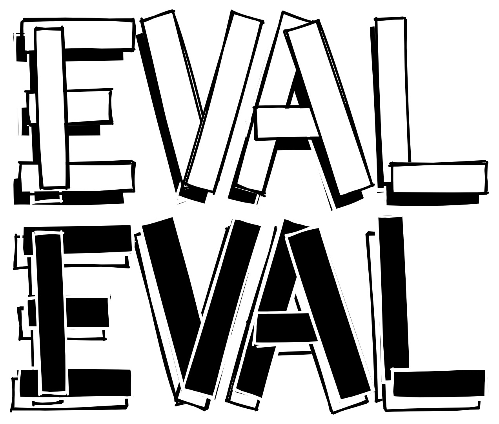

[English](/README.md) | 简体中文

# EvalCSU-Template

<p align="center"></p>

<p align="center">
  
  
  
  
  
</p>


> EvalCSU-Template 是基本结构的模板：告诉你如何以 EvalCSU 的方式构建你的代码。

- [EvalCSU-Template](#evalcsu-template)
  - [核心](#核心)
  - [景观](#景观)
  - [贡献](#贡献)
  - [许可证](#许可证)
  - [关于](#关于)
  - [联系](#联系)

## 核心

EvalCSU 将为你提供大部分的课程设计演示，这意味着你没有必要在垃圾桶里寻找茶点。

顺便说一下，这并不意味着你可以直接复制我们的代码来达到高的效果。我们会控制演示的完成度，使其只达到良。

更重要的是，EvalCSU 希望你把它看作是一个基本版本，并从你的思维出发，尽力把它变成现实。

<p align="center">欢迎为 EvalCSU 的每个仓库 点亮 star！</p>

## 景观

**完成**

...

**未完成**

- CSE
  - [ ] Java
- SOA

## 贡献

1. 确保英语是你做项目报告的第一语言。此外，创建中文版本，如 `README-zh.md`。
2. 确保有足够的.md来阐明你的代码的原理。否则，就和垃圾没有什么区别。
3. 希望开放讨论，进行技术交流。让我们一起变得更强大。
4. 希望建立更专业的代码结构。例如，你可以用Java构建如下。

```
├── AndroidManifest.xml
├── res
└── java
    └── net.micode.notes
				├── data
				├── model
				├── tool
				├── ui
				├── widget
				└── gtask
						├── data
						├── exception
				 		└── remote
```


**注意**

把你的解释文件放在 `global` 文件夹中。

## 许可证

这个软件库，甚至EvalCSU的所有软件库都遵循 [GPL-3.0许可证](LICENSE)

## 关于

你可以在 [EvalCSU](https://github.com/Jacob953/evalcsu) 找到我们所有人，希望你能带着你对开源精神的热情加入我们。

## 联系

电子邮件: jacob953@csu.edu.cn